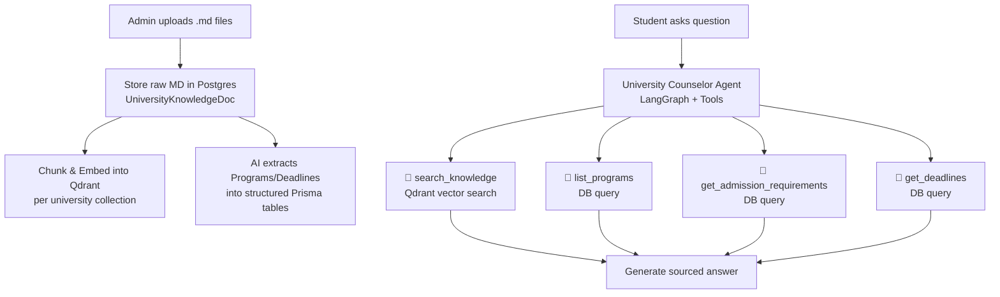
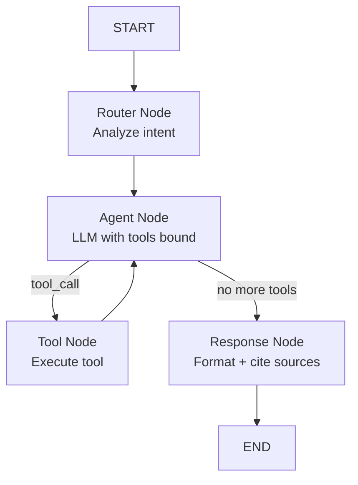

# University Data Pipeline & AI Counselor Agent (v2 — Qdrant + Tools)

Admins upload scraped markdown files per university via admin panel. Content is stored in Postgres **and** chunked/embedded into **Qdrant** for RAG. A tool-equipped LangGraph agent answers student queries using vector search + structured DB lookups.

## User Review Required

> [!IMPORTANT]
> **Qdrant runs locally via Docker** alongside Postgres. We'll use `GoogleGenerativeAIEmbeddings` (already have `@langchain/google-genai`) with the `gemini-embedding-001` model — no new API keys needed.

> [!WARNING]
> **New npm packages required:** `@langchain/qdrant`, `@qdrant/js-client-rest`. These are the official LangChain Qdrant integration and Qdrant JS client.

> [!IMPORTANT]
> The `ProgramDegreeType` enum currently has `BS, MS, MBA, PHD, ASSOCIATE, CERTIFICATE`. MEng degrees from scraper will map to `MS`. Let me know if you want a separate `MENG` value.

---

## Architecture Overview



---

## Proposed Changes

### Infrastructure

#### [MODIFY] [docker-compose.yml](file:///d:/workos/BeyondCampus/docker-compose.yml)

Add Qdrant service:

```yaml
qdrant:
  image: qdrant/qdrant:latest
  container_name: beyondcampus-qdrant
  restart: unless-stopped
  ports:
    - '6333:6333'   # REST API
    - '6334:6334'   # gRPC
  volumes:
    - qdrant_data:/qdrant/storage
```

#### [MODIFY] [.env.example](file:///d:/workos/BeyondCampus/.env.example)

Add: `QDRANT_URL=http://localhost:6333`

---

### Database Schema

#### [MODIFY] [schema.prisma](file:///d:/workos/BeyondCampus/database/prisma/schema.prisma)

Add `UniversityKnowledgeDoc` model + relation on [University](file:///d:/workos/BeyondCampus/src/services/universityService.ts#50-58):

```prisma
enum KnowledgeDocCategory {
  ADMISSIONS
  COURSES
  CAMPUS_LIFE
  SCHOLARSHIPS
  STAFF
}

model UniversityKnowledgeDoc {
  id           String                @id @default(uuid())
  universityId String
  category     KnowledgeDocCategory
  content      String                // raw markdown
  fileName     String
  embeddedAt   DateTime?             // when chunks were embedded in Qdrant
  processedAt  DateTime?             // when AI extracted structured data
  createdAt    DateTime              @default(now())
  updatedAt    DateTime              @updatedAt

  university   University @relation(fields: [universityId], references: [id], onDelete: Cascade)

  @@unique([universityId, category])
  @@index([universityId])
}
```

---

### Vector Store Layer

#### [NEW] `src/lib/qdrant.ts`

- Initialize `QdrantClient` from `@qdrant/js-client-rest`
- Initialize `GoogleGenerativeAIEmbeddings` with `text-embedding-004` model
- Helper: `ensureCollection(universityId)` — creates a Qdrant collection per university
- Helper: `embedAndStore(universityId, category, markdownContent)` — chunks the markdown (~500 tokens per chunk with overlap), embeds via Google, upserts into Qdrant with metadata `{ category, universityId, chunkIndex }`
- Helper: `searchKnowledge(universityId, query, topK=5)` — semantic search scoped to one university

---

### Admin Upload API

#### [NEW] `src/app/api/admin/universities/[id]/knowledge/route.ts`

- **GET**: Returns all `UniversityKnowledgeDoc` for a university
- **POST**: Accepts `{ category, content, fileName }`:
  1. Upserts raw MD into `UniversityKnowledgeDoc` (Postgres)
  2. Chunks & embeds into Qdrant via `embedAndStore()`
  3. Updates `embeddedAt` timestamp

#### [NEW] `src/app/api/admin/universities/[id]/knowledge/process/route.ts`

- **POST**: Sends courses + admissions MD content to Gemini for structured extraction
- Upserts `Program` and `Deadline` records
- Updates `processedAt` timestamp

---

### Admin Upload UI

#### [NEW] `src/app/admin/universities/[id]/knowledge/page.tsx`

Premium dark-themed page with 5 upload slots:
- Each slot: drag-and-drop [.md](file:///d:/workos/BeyondCampus/README.md) upload, status badges (✓ Uploaded / ✓ Embedded / ✓ Processed)
- "Process All with AI" button for structured extraction
- Content preview with markdown rendering
- Link from university list/edit pages

---

### University Counselor Agent (Tool-Equipped)

#### [NEW] `src/lib/maya/universityAgent.ts`

**LangGraph ReAct Agent** with 4 tools:

| Tool | Description | Data Source |
|------|-------------|-------------|
| `search_knowledge` | Semantic search over all university docs | Qdrant vector search |
| `list_programs` | List all programs with filters (degree type, department) | Prisma `Program` table |
| `get_program_details` | Get full program info (description, duration, tuition, admission reqs) | Prisma + Qdrant (admission section) |
| `get_deadlines` | Get application deadlines for a program or all programs | Prisma `Deadline` table |

**Agent graph:**



**System prompt highlights:**
- Acts as the university's official counselor persona
- MUST use tools to look up information — never fabricate
- Cites source category after each answer (e.g., "📄 Source: Admissions Guide")
- Formats structured data (programs, deadlines) as clean markdown tables
- Handles multi-turn conversation with memory

#### [NEW] `src/lib/maya/universityTools.ts`

Tool definitions using LangChain's `DynamicStructuredTool`:
- Each tool has typed Zod schemas for input validation
- Each tool returns results with source metadata for citations

---

### Student Chat API & UI

#### [NEW] `src/app/api/universities/[id]/chat/route.ts`

- **POST**: Accepts `{ message, history[] }`, invokes the university agent, returns response with citations

#### [NEW] `src/app/(student)/university/[id]/chat/page.tsx`

Chat UI (matches existing dark theme):
- University name + counselor avatar in header
- Message bubbles with markdown rendering
- Source citation badges below AI responses (clickable category tags)
- Typing indicator with university branding

---

## Verification Plan

### Automated (Browser Tool)
1. Upload MIT markdown files via admin panel → verify Qdrant collection created
2. Click "Process with AI" → verify programs appear in DB
3. Open student chat → ask "How many courses do you offer?" → verify sourced response
4. Ask "Requirements for MS in CS?" → verify admissions data cited
5. Ask follow-up "Can I also apply to PhD?" → verify multi-turn context

### Manual
- User verifies chat response quality and source accuracy
